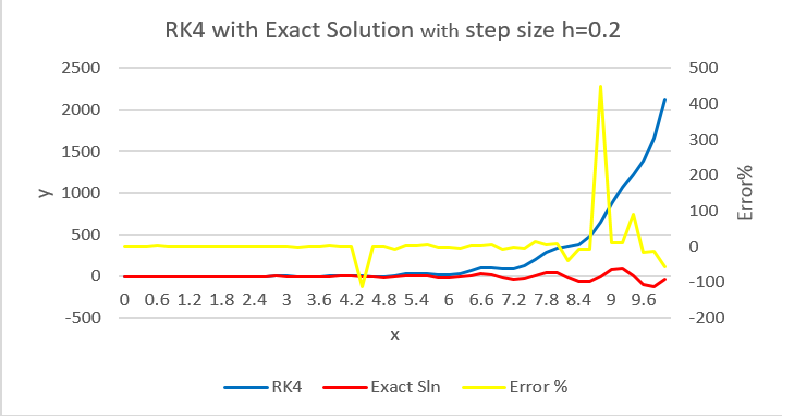

#Homework 1 : The Jello Cube (Continuous Simulation Assignment

## IDS6938-Simulation Techniques - [University of Central Florida](http://www.ist.ucf.edu/grad/)

This is the framework for homework #1. Please first read the [homework writeup](HomeWork%231.pdf).

The assignment is due: Monday, February 27 at 11:59PM (EST)

Arash Zarmehr (*)

**Part One: Numerical Analysis of Integration Functions* ***

The following ODE can be solved easily with Laplace method. Laplace method is the easy way to reach exact solution of some ODEs.

dy/dx=y-(1/2)*e^(x/2)*sin(5x)+5e^(x/2)*cos(5x)

Solution:

(ℒ) 

S*Y-Y(0)=Y-0.5*(5/((S-0.5)^2+25))+5*((S-0.5)/(((S-0.5)^2+25))

Y*(S-1)=Y(0)+5*((S-0.5)/((S-0.5)^2+25)-0.5/((S-0.5)^2+25))

Y*(S-1)=Y(0)+5*((S-1)/((S-0.5)^2+25))  

One of the answer which called public answer is S=1 but this is not answer which work for us. 

The second answer is:

Y=5/((S-0.5)^2+25)

Now we can get Laplace inverse to find a solution which we need.

(ℒ -1)

y(x)=e^0.5x*sin(5x)

Another way to find a solution for this ODE is to do Change of variables.

If we define a µ(x)= e^(-x)   and take integral we will reach the same solution.

We were able to find a exact solution for this ODE, but sometimes it is very hard to find axact solution. Alternatively, math scientists inttroduces approxiame methods which try to find a solution with numerical ways but the problem is that the solution would not be exact. accurancy of these method was always part of scientific discussions. 

* * *

Now, we run a solution with four different method to compare them and see the accurancy of them. For methods are exact solution, Euler method, Midpoint method and RK4.

Table below shows the data for Euler, Midpoint, RK4 and exact solution with error percentage of each for h=0.1 and y(0)=0.

figure 1 shows the differences between three solution method and excct solution. the picture shows RK4 has a bettter result than other solutions and the result is more closer to the exact solution comparing to the others. 

Figure 2 will compare different solutions error in one graph to show the accurancy of them.

This graph is proof of better accurancy for RK4 comparing to other solutions.

Now it is a time to play with our step size with RK4 solution to see the differencces and impostance of choosing good step size to decrease  the error percentages and inrease the accurancy.

***

First of all, let's choose h=0.2 (multiple of last time), h=0.5, h=1.0. Figure 3,4 and 5 will show the comparison of the RK4 and Exact solution and also error percentage.

lets take a look at figure 1 and 3 and compare the data we gained with h=0.1 and h=0.2.

if we choose some critical points in the graph such as x=8.8, the error percentage is 449.95% for h=0.1. At the same point x=8.8 with the h=0.2, error percentage is 449.6%, for h=0.5 is 9.89% and for h=1.0 is 41.53%.

in a nutshell, varing the integration method will changes accurancy as we saw in the first figure and comparing the error percentages. When we increase the x value, the error percentages are increasing and getting far away from the exact solution.

Increaing in the steping size will decreasing accurancy. So, the most accurate method is RK4 due to nearest answer to the exact solution with less error percentages. Actually, RK4 is combiantion of other two plus more features.

Table one shows the five first result value from different solution methods and link below shows the complete result values for numbers between 0.0 to 10.0.

[complete data result value(data.txt)](data.txt)

| X  | RK1 | RK2 | RK4 |  EXACT |
| ------------- | ------------- | ------------- | ------------- |------------- |
| 0.1  | 0.5 | 0.5090369272| 0.5040147599 | 0.5040062116 |
| 0.2  | 0.9860882804 | 0.9418917554| 0.9299833736 | 0.9299692608 |
| 0.3  | 1.336761843 | 1.178280127     | 1.158938591      | 1.158923832      |
| 0.4  |1.453584287      | 1.136380907      | 1.110627992      |1.110618385      |
| 0.5  | 1.28927035       | 0.7981592984     | 0.7684526188     |0.7684534442     |

Table 2 will show result value for RK4 with different step sizes.

| X | RK4,0.2 | RK4,0.5 | RK4,1.0 |
| ------------- | ------------- | ------------- | ------------- |
| 0.1  | N/A | N/A |N/A|
| 0.2  | 0.9301916447 | N/A | N/A | 
| 0.3  | N/A | N/A | N/A | 
| 0.4  |1.110755144      |N/A | N/A | 
| 0.5  | N/A |0.7628343855     | 0.4 |
| 0.6  |0.1902264458     |N/A | N/A | 
| 0.7  | N/A | N/A| N/A | 
| 0.8  | -1.129693114 |N/A | N/A | 
| 0.9  | N/A |N/A |N/A |
| 1.0  | -1.58171699  |-1.616611002 | -3.175159955 | 
 

Complete result value can be found at n=0.2rk4.txt, n=0.5rk4.txt and n=1.0rk4.txt
 [Complete Rerult Value for h=0.2RK4](n=0.2rk4.txt)

[Complete Rerult Value for h=0.5RK4](n=0.5rk4.txt)

[Complete Rerult Value for h=1.0RK4](n=1.0rk4.txt)

***part three : Written Questions***

1- What is the effect of the ks and kd parameters on the jello?

Ks that is elastic constant is related to increasing and decreasing of sinus domain of spring moving. ks is constant and its value will ultimately scale the force and it shows if the spring is highly elastic or quite rigid?

Figure 6 will compare the greater value of ks with smaller value. domain of greater ks is bigger than smaller ks.

Figure6 smaller ks

Figure7 greater ks

Kd is damping constant which it's responsibility in spring force is to absorb some of the energy and tend to decrease the velocity of the mass points attached to them. So damping depends on the velocity.

Figure 8 and 9 will shows the effec of smaller and greater value of Kd on the spring force.

Figure 8 smaller Kd

Figure9 greater Kd

2- What are the benefits and the drawbacks of the collision system used here? What are some different ways in which it could be improved?

the collision here shows the effects of spring forces on the jello cube and practical example of Newton's 3rd law. The best way to improve it, is to modifying the direction of retun=rn forces to be able to control the collision.

3- What are some example systems you could model with mass-srping simulation? Explain how would you contruct the model.

