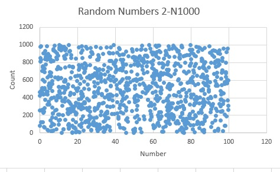
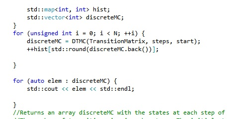

#Homework 2 :  Discrete-Event Simulation Assignment

## IDS6938-Simulation Techniques - [University of Central Florida](http://www.ist.ucf.edu/grad/)

[University of Central Florida](http://www.ist.ucf.edu/grad/)

The assignment is due: **Tuesday, March 28 at 11:59PM (EST)**

***Arash Zarmehr***

##Part 1: Empirical Tests of Randomness

We looked at different ways to generate [pseudo-random numbers](https://en.wikipedia.org/wiki/Pseudorandom_number_generator) and [quasi random numbers](https://en.wikipedia.org/wiki/Low-discrepancy_sequence). Generating random numbers are crucial to Discrete-Event simulations which rely on random variables and stochastic processes. This problem explores different random number generators, distributions, and statistics. 

* **(a)-** This part will run Five different radom number engines to get different numbers. Engines using uniform distribution for values between [0-100] and 1000 amount od samples. After generating random numbers it is time to take a look at statically tests to see how uniform are they?

For this purpose Chi-Square Test is done and results are Shown below.

Five Different randon number generatorand their data which is used for this assignments are:

1-  [Mersene Twister 19937 generator](Book2.xlsx)

The data for this random machine are shows in link above and also Chi-Square Test was done to show how uniform are these data. Chi-Square test was done by Excel.
Chi-Square Test Result:0.526518169
Mean: 49.36312
Figure 1 shows the random number distribution for this engine with 1000 numbers generating between 1 to 100.

 

2- [Knuth-B generator](book1.xlsx)
The data for this random machine are shows in link above and also Chi-Square Test was done to show how uniform are these data. Chi-Square test was done by Excel.
Chi-Square Test Result:0.128088823
mean: 48.87267
stdev: 29.07666

Figure 2 shows the random number distribution for this engine with 1000 numbers generating between 1 to 100.

 

3-  [*Minimal Standard minstd_rand generator*](book3.xlsx)

The data for this random machine are shows in link above and also Chi-Square Test was done to show how uniform are these data. Chi-Square test was done by Excel.
Chi-Square Test Result:-0.153931692
mean: 49.29835
stdev: 29.02319

Figure 3 shows the random number distribution for this engine with 1000 numbers generating between 1 to 100.

 

4- [*Ranlux 48 generator*](book5.xlsx)
The data for this random machine are shows in link above and also Chi-Square Test was done to show how uniform are these data. Chi-Square test was done by Excel.
Chi-Square Test Result:0.878220159
mean: 49.01093
stdev: 29.23106

Figure 4 shows the random number distribution for this engine with 1000 numbers generating between 1 to 100.
 

5-[* Quasi-Sobol Generator*](book4.xlsx)
The data for this random machine are shows in link above and also Chi-Square Test was done to show how uniform are these data. Chi-Square test was done by Excel.
Chi-Square Test Result:1
mean: 50.09043
stdev: 28.86488

Figure 5 shows the random number distribution for this engine with 1000 numbers generating between 1 to 100.
 

The results shows that the most uniform random number generator is 	Quasi- Sobol. As you can see above the Chi-Square test for Quasi-Sobol is 1. This means this generator is making the most uniform datas.

* **(b) -**  This part will test two of the random number engines with different *N* number. Part A used N=1000 and this part will use N=500

[*Quasi Random-Sobolo*](book7.xlsx)

The results for this generation is:
Chi-Square Test Result:1
mean: 49.99875
stdev: 28.84313

Figures 6 and 7 shows differences due to changing *N*. Figure 6 is for N=1000 and Figure 7 is for N=500.

 

 

[*Minimal Standard minstd_rand generator*](boook8.xlsx)
The results for this generation is:
Chi-Square Test Result:0.943965388
mean: 48.26720
stdev: 29.23172

Figures 8 and 9 shows differences due to changing *N*. Figure 8 is for N=1000 and Figure 9 is for N=500.
  

 

* **(c)** This part will show results for psedu-random number with a fixed random engine of Mersene Twister 19937 generator, and then vary five different [distributions](http://www.cplusplus.com/reference/random/) for just the psedo-random numbers.

 
1-uniform_real_distribution

 

2-normal_distribution

 

3-chi_squared_distribution

 

4-lognormal_distribution

5-weibull_distribution

* **(d)** This part is generating generate random numbers in two-dimensions for a unit square. Plot will shows the results for the different random number engines. The vertical axis should vary N in increasing order. The horizontal axis should show of the random number engines.The test will done for Three different N numbers of 500,1000 and 2500.

First 5 engines and single distribution:
 

Second 5 distribution and single engine:

 

##Part 2 - Snakes and Ladders (Discrete Event Markov Chains and Monte Carlo Simulations) 

A board game can be viewed mathematically as a Markov chain, where the probability of moving to the next position depends only on the position you are currently at and the chances provided by tossing a dice. For this part of the homework we will simulate the game "*Snakes and Ladders*" (This goes by other names: Chutes and Ladders, Moksha Patam but all essentially the same gameplay.)

##### Background

The classic game has 100 positions on the board. You toss one die, and move squares based on the result of the die. If you land on a ladder you move up the ladder to a higher numbered square. If you land on a snake's mouth, you descend to a lower numbered square. For purposes of simulation, we will add one extra square 0 (starting position). So there are 101 positions on the board.

The game is **memoryless** - your progression to the next position is independent of how you arrived there (opposed to Blackjack or Candyland where your progression is based on what cards have been drawn). A Markov Chain defines the probability of a move from state *i* to state *j* by a **Transition Matrix**, *T*. So in the case of *Snakes and Ladders* the dimensions of a transition matrix is 101x101.

* **(a) Null State Game transition matrix** The *null state game* is defined by a game with no snakes and no ladders. This simplifies the game to just the moves of the two dice rolls. Create the transition matrix for the null state game. The Transition Matrix would be decided by the roll of a fair, six-sided die, so it would start to look like:

  

From state 0 it is equally probable of landing on squares 1-6. From state 1 t is equally probable of landing on squares 2-7, and so on. Create this transition matrix. The end is trickier, we will consider any roll past 100 a win case. (Opposed to rolling exactly onto square 100.) Confirm you have a well formed stochastic matrix (Write checks for confirming each row of T sums to one and all elements are non-negative). The Transition Matrix methods can be found in the TransitionMatrix.h file.

 

 

DTMC:

Markov:

All of the results for Markov and DTMC are avaiable in Solution Files.

Now will Simulate and analyze the results of Snakes and Ladders. Construct a new transition matrix based on the table:

for this porpuse the new code will added to the last code to simulate the snakes and ladders. The changes should be made in the transition matrix like figure below.

##Part 3 - Discrete Event Simulation - Queue Simulation 

This problem will look at queues and commonly used performance measures. For this problem we will look to design a simple airport security check. We will make the following assumptions: (1) there is only one airline - Southwest; (2) passengers' interarrival times are independent and identically distributed (IID) with an exponential distribution with mean 1 / lambda. The service times are also assumed to be IID and exponentially distributed random variables with mean 1 / mu.

  

When a passanger arrives they have to wait in a queue to present their ID and ticket to the gate agent with all the other passengers. Once approved by the agent they will have to pass through a security check. Since this is Orlando, there are only 3 open metal/screening devices open and again passangers have to wait in a queue. After passing through security you again have to wait in a queue to board your plane.

* **(a)** First of all will define boarding conditions. Checkin will have a *mu* of 53 and accept new arrivals, the security gates will have a *mu* of 20, and will not accept new arrivials, boarding will have a *mu* of 80. 

* **(b)** The error range will be 0.002.

* **(c)** Code to caculate the expected results for values below was added.

  *  expected_server_utilization 

  *    expected idle prob

  *   expected queue length 

  *  expected number customers 

  * expected waiting time

  * expected response time

 

*  **(d)** Result:

Server Idle: -nan(ind) [1]
*********
Arrivals: 0 Services: 0
Within 90% CI? false
Mean Response Time: inf [0.05]
Mean Waiting Time: -nan(ind) [0]
Mean Queue Length: -nan(ind) [0]
Mean Number of Customers: -nan(ind) [0]
Server Utilization: 0 [0]
Server Idle: -nan(ind) [1]
*********
Arrivals: 0 Services: 0
Within 90% CI? false
Mean Response Time: inf [0.05]
Mean Waiting Time: -nan(ind) [0]
Mean Queue Length: -nan(ind) [0]
Mean Number of Customers: -nan(ind) [0]
Server Utilization: 0 [0]
Server Idle: -nan(ind) [1]
*********
Arrivals: 1 Services: -1
Within 90% CI? false
Mean Response Time: -0 [0.0135135]
Mean Waiting Time: -0 [0.00101351]
Mean Queue Length: 0 [0.00608108]
Mean Number of Customers: 0 [0.0810811]
Server Utilization: 0 [0.075]
Server Idle: 1 [0.925]
*********
Arrivals: 1 Services: -1
Within 90% CI? false
Mean Response Time: -0 [0.0212766]
Mean Waiting Time: -0 [0.00240867]
Mean Queue Length: 0 [0.014452]
Mean Number of Customers: 0 [0.12766]
Server Utilization: 0 [0.113208]
Server Idle: 1 [0.886792]
*********
Arrivals: 0 Services: 0
Within 90% CI? false
Mean Response Time: inf [0.05]
Mean Waiting Time: -nan(ind) [0]
Mean Queue Length: -nan(ind) [0]
Mean Number of Customers: -nan(ind) [0]
Server Utilization: 0 [0]
Server Idle: -nan(ind) [1]
*********
Arrivals: 0 Services: 0
Within 90% CI? false
Mean Response Time: inf [0.05]
Mean Waiting Time: -nan(ind) [0]
Mean Queue Length: -nan(ind) [0]
Mean Number of Customers: -nan(ind) [0]
Server Utilization: 0 [0]
Server Idle: -nan(ind) [1]
*********
Arrivals: 0 Services: 0
Within 90% CI? false
Mean Response Time: inf [0.05]
Mean Waiting Time: -nan(ind) [0]
Mean Queue Length: -nan(ind) [0]
Mean Number of Customers: -nan(ind) [0]
Server Utilization: 0 [0]
Server Idle: -nan(ind) [1]
*********
Arrivals: 1 Services: -1
Within 90% CI? false
Mean Response Time: -0 [0.0135135]
Mean Waiting Time: -0 [0.00101351]
Mean Queue Length: 0 [0.00608108]
Mean Number of Customers: 0 [0.0810811]
Server Utilization: 0 [0.075]
Server Idle: 1 [0.925]
*********
Arrivals: 1 Services: -1
Within 90% CI? false
Mean Response Time: -0 [0.0212766]
Mean Waiting Time: -0 [0.00240867]
Mean Queue Length: 0 [0.014452]
Mean Number of Customers: 0 [0.12766]
Server Utilization: 0 [0.113208]
Server Idle: 1 [0.886792]
*********
Arrivals: 0 Services: 0
Within 90% CI? false
Mean Response Time: inf [0.05]
Mean Waiting Time: -nan(ind) [0]
Mean Queue Length: -nan(ind) [0]
Mean Number of Customers: -nan(ind) [0]
Server Utilization: 0 [0]
Server Idle: -nan(ind) [1]
*********
Arrivals: 0 Services: 0
Within 90% CI? false
Mean Response Time: inf [0.05]
Mean Waiting Time: -nan(ind) [0]
Mean Queue Length: -nan(ind) [0]
Mean Number of Customers: -nan(ind) [0]
Server Utilization: 0 [0]
Server Idle: -nan(ind) [1]
*********
Arrivals: 0 Services: 0
Within 90% CI? false
Mean Response Time: inf [0.05]
Mean Waiting Time: -nan(ind) [0]
Mean Queue Length: -nan(ind) [0]
Mean Number of Customers: -nan(ind) [0]
Server Utilization: 0 [0]
Server Idle: -nan(ind) [1]
*********
Arrivals: 1 Services: -1
Within 90% CI? false
Mean Response Time: -0 [0.0135135]
Mean Waiting Time: -0 [0.00101351]
Mean Queue Length: 0 [0.00608108]
Mean Number of Customers: 0 [0.0810811]
Server Utilization: 0 [0.075]
Server Idle: 1 [0.925]
*********
Arrivals: 1 Services: -1
Within 90% CI? false
Mean Response Time: -0 [0.0212766]
Mean Waiting Time: -0 [0.00240867]
Mean Queue Length: 0 [0.014452]
Mean Number of Customers: 0 [0.12766]
Server Utilization: 0 [0.113208]
Server Idle: 1 [0.886792]
*********
Arrivals: 0 Services: 0
Within 90% CI? false
Mean Response Time: inf [0.05]
Mean Waiting Time: -nan(ind) [0]
Mean Queue Length: -nan(ind) [0]
Mean Number of Customers: -nan(ind) [0]
Server Utilization: 0 [0]
Server Idle: -nan(ind) [1]
*********
Arrivals: 0 Services: 0
Within 90% CI? false
Mean Response Time: inf [0.05]
Mean Waiting Time: -nan(ind) [0]
Mean Queue Length: -nan(ind) [0]
Mean Number of Customers: -nan(ind) [0]
Server Utilization: 0 [0]
Server Idle: -nan(ind) [1]
*********
Arrivals: 0 Services: 0
Within 90% CI? false
Mean Response Time: inf [0.05]
Mean Waiting Time: -nan(ind) [0]
Mean Queue Length: -nan(ind) [0]
Mean Number of Customers: -nan(ind) [0]
Server Utilization: 0 [0]
Server Idle: -nan(ind) [1]
*********
Arrivals: 1 Services: -1
Within 90% CI? false
Mean Response Time: -0 [0.0135135]
Mean Waiting Time: -0 [0.00101351]
Mean Queue Length: 0 [0.00608108]
Mean Number of Customers: 0 [0.0810811]
Server Utilization: 0 [0.075]
Server Idle: 1 [0.925]
*********
Arrivals: 1 Services: -1
Within 90% CI? false
Mean Response Time: -0 [0.0212766]
Mean Waiting Time: -0 [0.00240867]
Mean Queue Length: 0 [0.014452]
Mean Number of Customers: 0 [0.12766]
Server Utilization: 0 [0.113208]
Server Idle: 1 [0.886792]
*********
Arrivals: 0 Services: 0
Within 90% CI? false
Mean Response Time: inf [0.05]
Mean Waiting Time: -nan(ind) [0]
Mean Queue Length: -nan(ind) [0]
Mean Number of Customers: -nan(ind) [0]
Server Utilization: 0 [0]
Server Idle: -nan(ind) [1]
*********
Arrivals: 0 Services: 0
Within 90% CI? false
Mean Response Time: inf [0.05]
Mean Waiting Time: -nan(ind) [0]
Mean Queue Length: -nan(ind) [0]
Mean Number of Customers: -nan(ind) [0]
Server Utilization: 0 [0]
Server Idle: -nan(ind) [1]
*********
Arrivals: 0 Services: 0
Within 90% CI? false
Mean Response Time: inf [0.05]
Mean Waiting Time: -nan(ind) [0]
Mean Queue Length: -nan(ind) [0]
Mean Number of Customers: -nan(ind) [0]
Server Utilization: 0 [0]
Server Idle: -nan(ind) [1]
*********
Arrivals: 1 Services: -1
Within 90% CI? false
Mean Response Time: -0 [0.0135135]
Mean Waiting Time: -0 [0.00101351]
Mean Queue Length: 0 [0.00608108]
Mean Number of Customers: 0 [0.0810811]
Server Utilization: 0 [0.075]
Server Idle: 1 [0.925]
*********
Arrivals: 1 Services: -1
Within 90% CI? false
Mean Response Time: -0 [0.0212766]
Mean Waiting Time: -0 [0.00240867]
Mean Queue Length: 0 [0.014452]
Mean Number of Customers: 0 [0.12766]
Server Utilization: 0 [0.113208]
Server Idle: 1 [0.886792]
*********
Arrivals: 0 Services: 0
Within 90% CI? false
Mean Response Time: inf [0.05]
Mean Waiting Time: -nan(ind) [0]
Mean Queue Length: -nan(ind) [0]
Mean Number of Customers: -nan(ind) [0]
Server Utilization: 0 [0]
Server Idle: -nan(ind) [1]
*********
Arrivals: 0 Services: 0
Within 90% CI? false
Mean Response Time: inf [0.05]
Mean Waiting Time: -nan(ind) [0]
Mean Queue Length: -nan(ind) [0]
Mean Number of Customers: -nan(ind) [0]
Server Utilization: 0 [0]
Server Idle: -nan(ind) [1]
*********
Arrivals: 0 Services: 0
Within 90% CI? false
Mean Response Time: inf [0.05]
Mean Waiting Time: -nan(ind) [0]
Mean Queue Length: -nan(ind) [0]
Mean Number of Customers: -nan(ind) [0]
Server Utilization: 0 [0]
Server Idle: -nan(ind) [1]
*********
Arrivals: 1 Services: -1
Within 90% CI? false
Mean Response Time: -0 [0.0135135]
Mean Waiting Time: -0 [0.00101351]
Mean Queue Length: 0 [0.00608108]
Mean Number of Customers: 0 [0.0810811]
Server Utilization: 0 [0.075]
Server Idle: 1 [0.925]
*********
Arrivals: 1 Services: -1
Within 90% CI? false
Mean Response Time: -0 [0.0212766]
Mean Waiting Time: -0 [0.00240867]
Mean Queue Length: 0 [0.014452]
Mean Number of Customers: 0 [0.12766]
Server Utilization: 0 [0.113208]
Server Idle: 1 [0.886792]
*********
Arrivals: 0 Services: 0
Within 90% CI? false
Mean Response Time: inf [0.05]
Mean Waiting Time: -nan(ind) [0]
Mean Queue Length: -nan(ind) [0]
Mean Number of Customers: -nan(ind) [0]
Server Utilization: 0 [0]
Server Idle: -nan(ind) [1]
*********
Arrivals: 0 Services: 0
Within 90% CI? false
Mean Response Time: inf [0.05]
Mean Waiting Time: -nan(ind) [0]
Mean Queue Length: -nan(ind) [0]
Mean Number of Customers: -nan(ind) [0]
Server Utilization: 0 [0]
Server Idle: -nan(ind) [1]
*********
Arrivals: 0 Services: 0
Within 90% CI? false
Mean Response Time: inf [0.05]
Mean Waiting Time: -nan(ind) [0]
Mean Queue Length: -nan(ind) [0]
Mean Number of Customers: -nan(ind) [0]
Server Utilization: 0 [0]
Server Idle: -nan(ind) [1]
*********
Arrivals: 1 Services: -1
Within 90% CI? false
Mean Response Time: -0 [0.0135135]
Mean Waiting Time: -0 [0.00101351]
Mean Queue Length: 0 [0.00608108]
Mean Number of Customers: 0 [0.0810811]
Server Utilization: 0 [0.075]
Server Idle: 1 [0.925]
*********

* **(e)** This part will implement the simulation of this airline queue by Anylogic personal edition. Anylogic is a modeling and simulation software.

 

Link below can run the simulation with anylogic.

[Anylogic Queue Simulation ](Homework2\Solution Files\Part 3\Airport Securitygate Queue)

##Part 4 - Implementing Extra Features (10 pts)

* **(5 Points)** - Implement different distributions inside the Quasi random sequences and add them to your analysis for appropriate subparts of Part 1.

* **(10 Points)** - Add a 2D visualization to AnyLogic for Part 3.

* **(10 Points)** - Add a 3D visualization to AnyLogic for Part 3.

* **(10 Points)** - Setup up SmartGrid or a Microgrid System that creates resources of power from wind, solar, and electric grid. Set up various devices in your house to draw power. [Reference 1](http://www.sciencedirect.com/science/article/pii/S1877050916301740),   [Reference 2](http://www.tandfonline.com/doi/full/10.1080/19401493.2013.866695?src=recsys&).

