# Homework 3 : Agent based Simulation Assignment 

## IDS6938-Simulation Techniques - [University of Central Florida](http://www.ist.ucf.edu/grad/)

[University of Central Florida](http://www.ist.ucf.edu/grad/)
This is the framework for homework #3. 

The assignment is due: **Monday, April  24 at 11:59PM (EST)**

***Arash Zarmehr***

# Introduction
The goal of this assignment is to enable the behavioral animation of vehicle-like walking agents. 

You will be expected to compose a *final report* which demonstrates your understanding on the material in each section of the assignment. Be visual! - Pictures say a thousand words so you do not have to. Show off your different configurations and really explore the assignment.

### Part 1: Agent Behavior Simulation

The goal of this assignment is to enable the steering behavioral animation of agents.

We represent an agent as a two-dimensional disk with mass (m) and moment-of-inertia (I) that is capable of generating a force F along body x-axis with a torque about the z-axis. For this assignment assume that the agent only translates in the world x-y plane and rotates about the body z-axis.

For the purpose of this part, some behaviors will be followed to make agent act like what player like. Such as flee, seak, obstacle avoidance and etc.

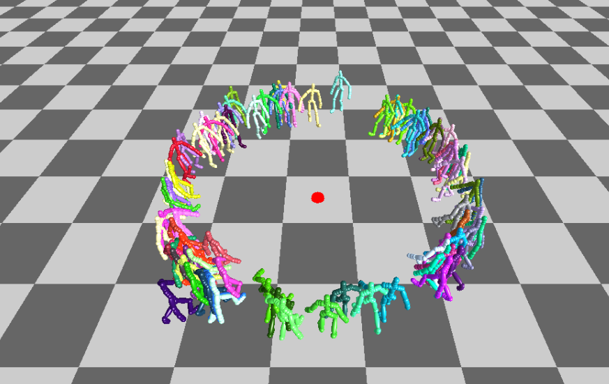

***2.a. Basic code complement***

First of all, this part will compute derivative vector given input and state vectors.

Description of agent state vector and input vector:

state[0] is the position of the agent in local body coordinates (almost useless in this project);
state[1] is the orientation angle of the agent with respect to world (i.e. global) coordinates;
state[2] is the velocity of the agent in local body coordinates.
state[3] is the angular velocity of the agent in world coordinates.
input[0] is the force in local body coordinates;
input[1] is the torque in local body coordinates
You will need to set deriv[0], deriv[1], deriv[2], deriv[3]. Compute derivative vector given input and state vectors. This function sets derive vector to appropriate values after being called.

deriv[0] is the velocity of the agent in local body coordinates
deriv[1] is the angular velocity of the agent in world coordinates
deriv[2] is the force in local body coordinates divided by the mass.
deriv[3] is the torque in local body coordinates divided by the inertia.
You also must implement SIMAgent::InitValues(): Try to figure out appropriate values for control and behavior settings. You need to find out appropriate values for: SIMAgent::Kv0, SIMAgent::Kp1, SIMAgent::Kv1, SIMAgent::KArrival, SIMAgent::KDeparture, SIMAgent::KNoise,	SIMAgent::KWander, SIMAgent::KAvoid, SIMAgent::TAvoid, SIMAgent::RNeighborhood, SIMAgent::KSeparate, SIMAgent::KAlign, SIMAgent::KCohesion.

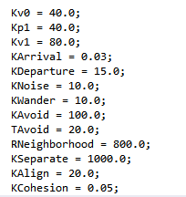 

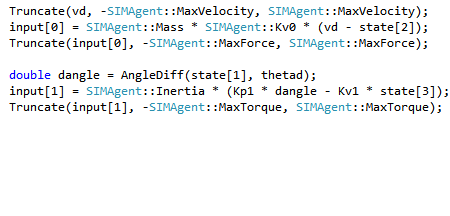 

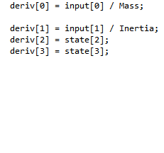 

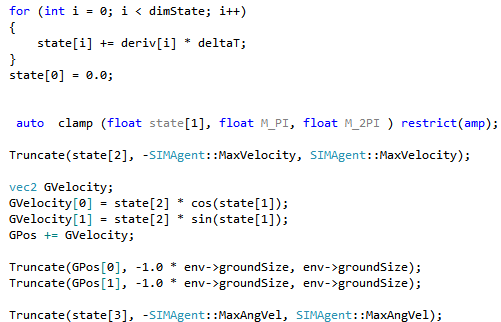 

Now after entering derivations codes, it is time to go through different behavior of the agents.

1.seek behavior, whisch is defined as an attempts of an agent to steer towards a specified target.
for this porpuse desired velocity and desired orientation are added to the codes.

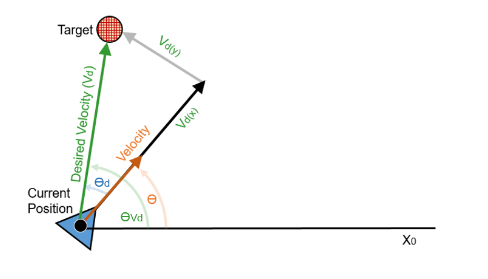

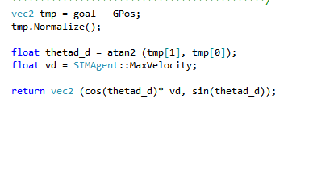

2.Flee behavior, whisch is defined as an attempts of an agent to steer away from a specified target.

The only diffference between seek and flee is Pi radian different in angle because flee is opposite in direction of the seek.

3.Arrival and departure behavior, which is defined as an attempts of the agent to steer towards a specified target and slows down when it gets close.

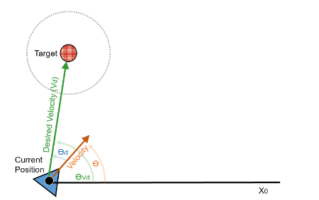

arrival and departure behaviors are such as seek and flee. They are opposite in the directions.

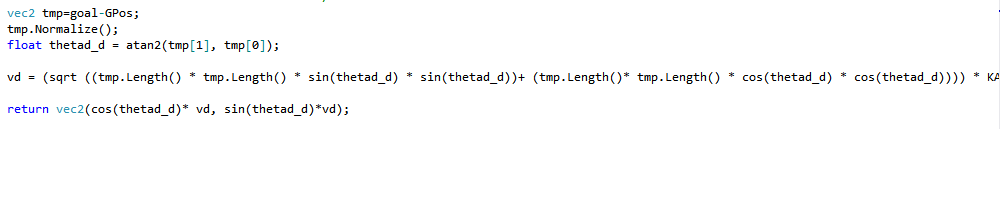

and also departure:

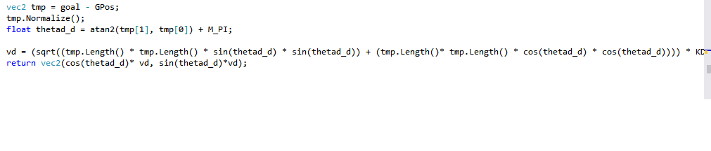

The other behaviors will show bleow by different figures.

Seek
Flee
Arrival
Departure
Wander

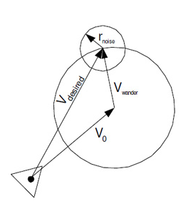

Obstacle Avoidance

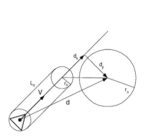

Seperation, Cohesion, Alignment, Flocking, Leader Following

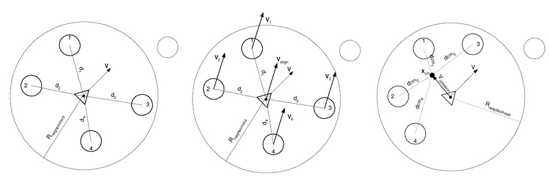

The figure of what they act:

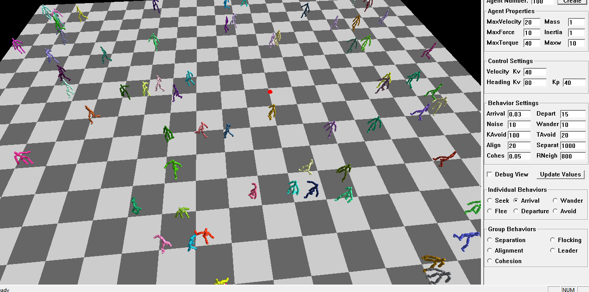

### Part 2: Simulating a simple pedestrian flow

The goal of this part of the assigment is to simulate the pedestrain flow for various configurations. Pedestrian traffic simulation is an important, sometimes required, stage for certain construction projects such as shopping centers, airports, railway stations, or stadiums. hese analyses can be used by architects in the design stage, by facilities owners contemplating changes, by city planners to evaluate rush hours, or even by civil authorities to simulate evacuations or other emergencies.

***2.a. Subway Entrance Pedestrian Flow Simulation***

This part will use a Anylogic Software and it's example for the Subway Entrance example. It would create the appropriate boundaries and walls, and the display ther pedestrian density map, statistics, 2D and 3D animations.

Figure 1 will show the general shape of this simulation for the subway entrance hall.
 

After creating a simple model with one pedestrian source and one ticket checking center and sink source which is the place that passengers go to the train, the first step of modeling is done.

Figure 2 will show the 2d simulating of pedestrian flow.

Also available at link below in youtube.

[2D Subway Pedestrian Flow Simulation](https://youtu.be/ip4WhfQTPiw)

Figure 3 will show the Density of flow simulation and Figure 4 will show 3D simulation of the pedestrian Flow. Also you can watch small clips of them in links below.

Please check links below:

[2D Subway Pedestrian Flow Denisty Simulation](https://youtu.be/aC3nPhYUumQ)

[3D Subway Pedestrian Flow Simulation](https://youtu.be/fjGbC23jfZY)

Figure below shows static analyze of the simulation for one area before ticket check and one after ticket checks that are shown in the figure.

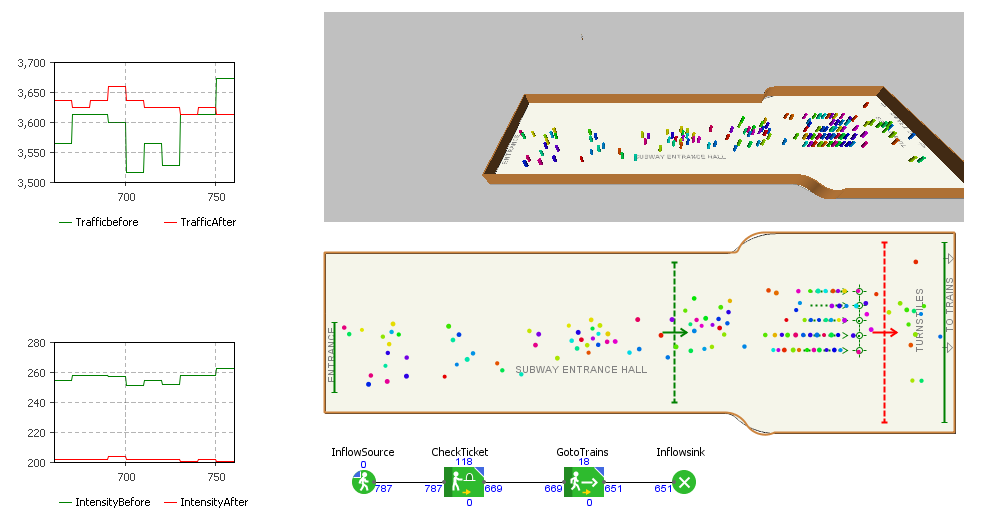

Also link below show the simulation video. Please check it.

[Stats Subway Pedestrian Flow Simulation](https://youtu.be/5_-EqiRQMe4)

***2.b. Pedestrians Flow Simulation Through the Maze***

This part will simulate the pedestrian flow through the choosen maze and PDM, STATS and animations will be done like part a.

In Figure 6, Wall border of choosen maze is defined.

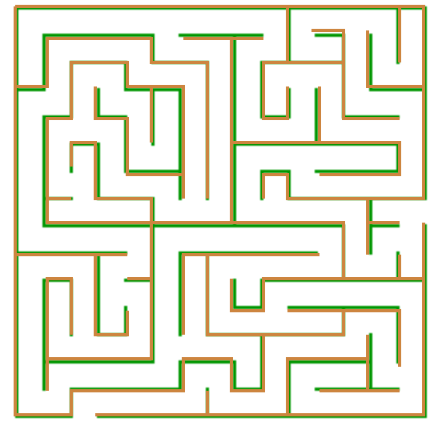

Then, simple model will be generated and the simple 2D will be run by Anylogic.
The results are shown in the figure 7 & 8.

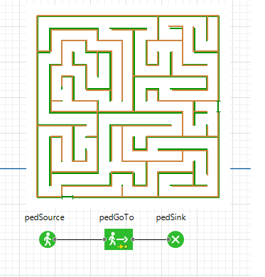

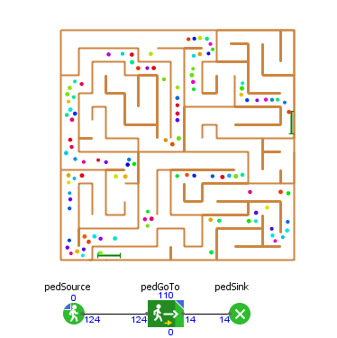

Please check link below for simple model.

[2D Maze Pedestrian Flow Simulation](https://youtu.be/DKk_B2gLhyA)

Now, It is time to check the results for 3D simulation, check the pedestrian flow density and statics of traffic and intensity in the choosen area. All will show in the figures 9, 10, 11. 

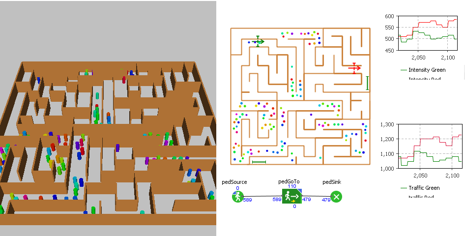

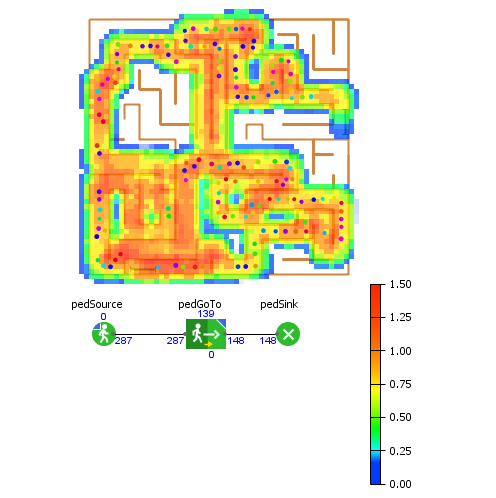

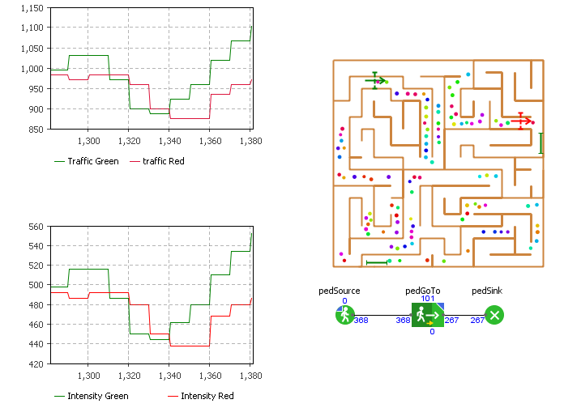

Please Check link belows for the videos of above results.

[3D Maze Pedestrian Flow Simulation](https://youtu.be/eXPmBYsG_Y4)

[Density of Maze Pedestrian Flow Simulation](https://youtu.be/JWrEdRiAazo)

[Statics for Maze Pedestrian Flow Simulation](https://youtu.be/4COGMGPMu8M)

Now it is time to vary parameters in the agents to give them different behaviors and show the pedestrians change how they navigate the maze.

For this purpose, the wait time is assumed before pedestrian go outside of maze.

.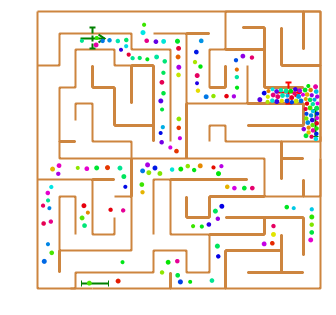

Also please check link below for videos.

.
.[Maze Pedestrian Behave Flow Simulation](https://youtu.be/UST9O8mrTm0)

[Density for Maze Pedestrian Behave Flow Simulation](https://youtu.be/30EBQFDX6wQ)
.
.

***2.C. Model and Analyze a building in the University of Central Florida Campus***

For this part, Callbourn Hall building which is the one of the old buildings in the campus of the [University of Central Florida](http://www.ist.ucf.edu/grad/) is choosen.

Colbourn Hall, formerly known as the Humanities and Fine Arts building, first began construction in 1972. In addition to the departments of English, History, Modern Languages & Literatures, and Writing and Rhetoric, Colbourn Hall includes programs for Women’s Studies, Judaic Studies, Africana Studies, and Latin American, Caribbean and Latino Studies. It also houses the University Writing Center and Graduate Student Center. Named after former UCF President Trevor Colbourn, the building has remained a focal point of academic life since the university’s early years.

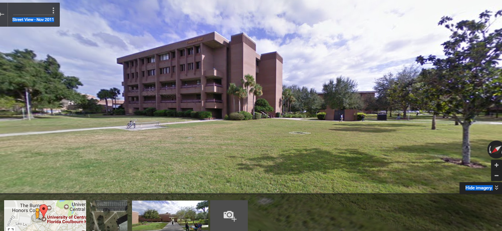

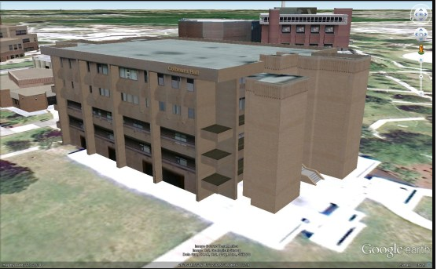

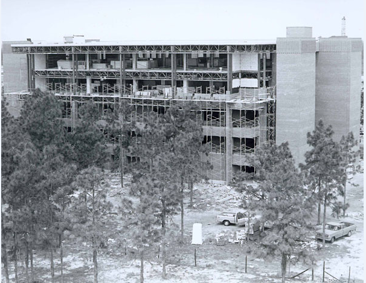

For this purpose, first floor of this building will be simulate with anylogic for daily office ruotine, specia; event, Emergency Evacuation and normal egrees. Also,some features of outside design such as entrance and etc. will be cosider to find out if the building is suitable for nowadays daily jobs or not.

Figure 16 will show the plan of first floor which will be analyzing for tgis part.

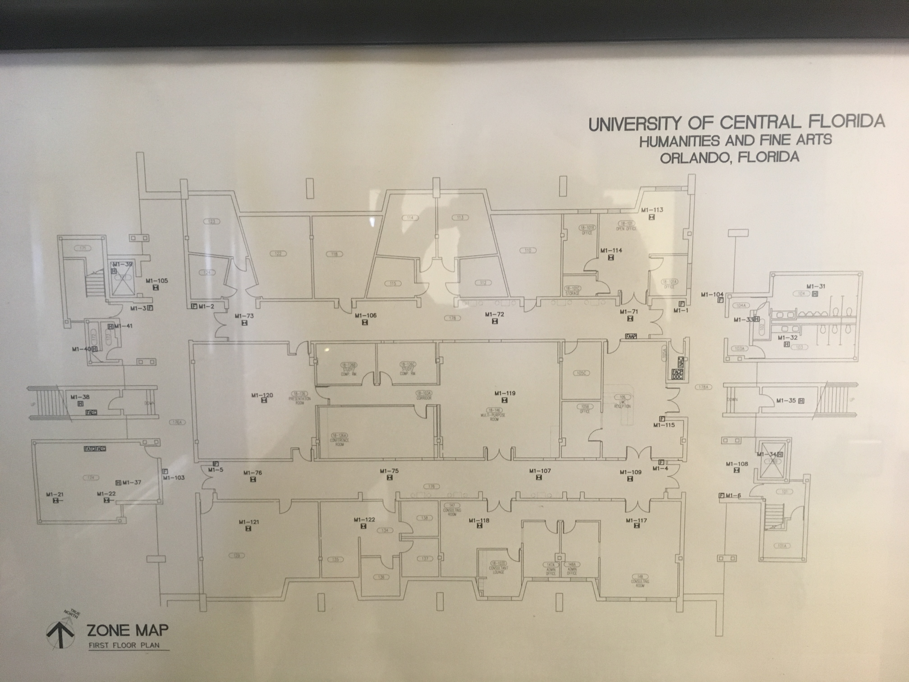

***2.a.1.*** First Analysis is for daily office routine activities that contain few workshops, UCF Writing center visitors, Offices visitor, Graduate Student center offices.

Lets start with the regular office hour. The senario would be the times that classrooms and different special rooms are closed and usw regular offices such as UCF writing center and others.

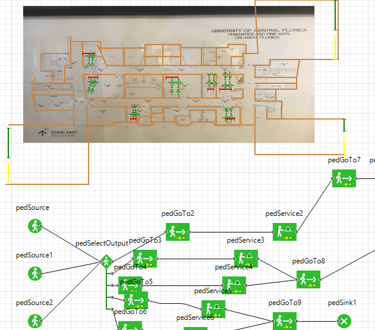

in the figure above the yello target lines are exit from building, green target lines are entrance to the building and red colors target lines are service desks at the offices.

Now lets take a look at the video of this senario.

[Colbourn Hall Regular office hour simualtion senario](https://youtu.be/2eSHqyVqX24)

Another senario is emergency evacuation. For this purpose, Red target lines would be sources and green target lines would be exit.

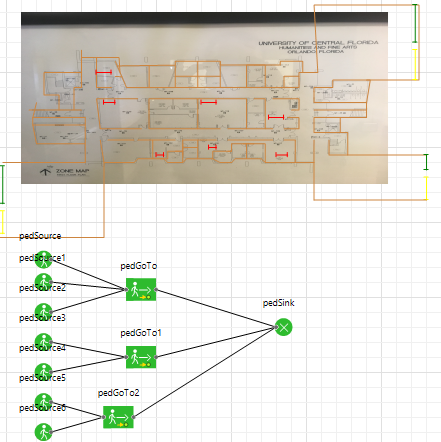

[Colbourn Hall evacuation senario](https://youtu.be/G2frvA4UC5s)

Also figure below shows the evacuation senario density picture which red parts shows the highes density and problem in those area during emergency exits.

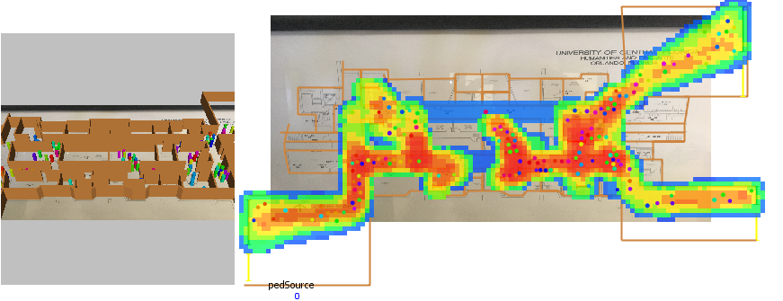

