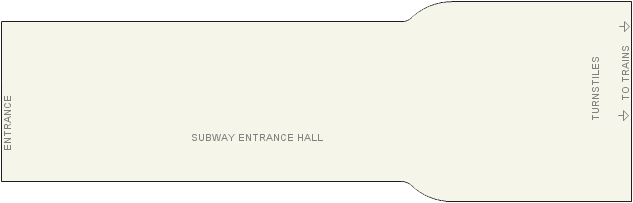
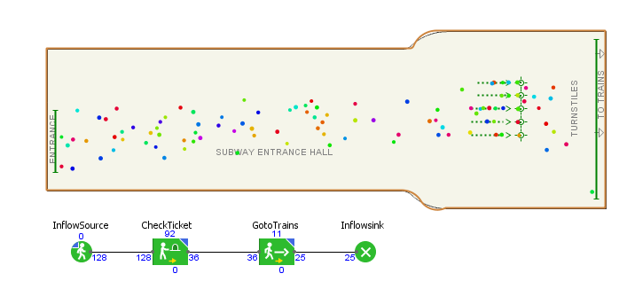
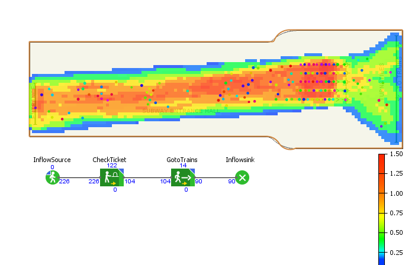
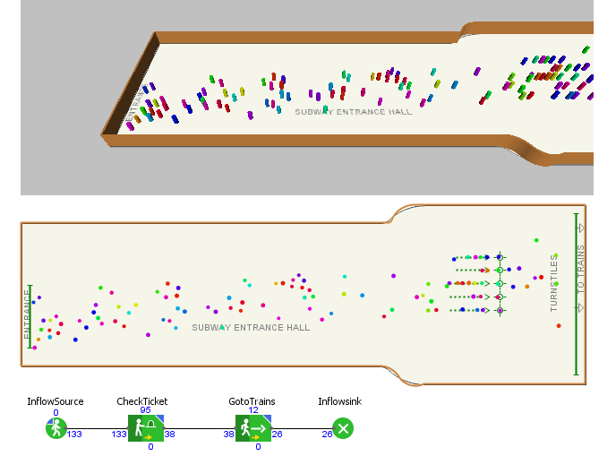

# Homework 3 : Agent based Simulation Assignment 

## IDS6938-Simulation Techniques - [University of Central Florida](http://www.ist.ucf.edu/grad/)

[University of Central Florida](http://www.ist.ucf.edu/grad/)
This is the framework for homework #3. 

The assignment is due: **Monday, April  24 at 11:59PM (EST)**

***Arash Zarmehr***

# Introduction
The goal of this assignment is to enable the behavioral animation of vehicle-like walking agents. 

You will be expected to compose a *final report* which demonstrates your understanding on the material in each section of the assignment. Be visual! - Pictures say a thousand words so you do not have to. Show off your different configurations and really explore the assignment.

### Part 2: Simulating a simple pedestrian flow

The goal of this part of the assigment is to simulate the pedestrain flow for various configurations. Pedestrian traffic simulation is an important, sometimes required, stage for certain construction projects such as shopping centers, airports, railway stations, or stadiums. hese analyses can be used by architects in the design stage, by facilities owners contemplating changes, by city planners to evaluate rush hours, or even by civil authorities to simulate evacuations or other emergencies.

***2.a. Subway Entrance Pedestrian Flow Simulation***

This part will use a Anylogic Software and it's example for the Subway Entrance example. It would create the appropriate boundaries and walls, and the display ther pedestrian density map, statistics, 2D and 3D animations.

Figure 1 will show the general shape of this simulation for the subway entrance hall.
 

After creating a simple model with one pedestrian source and one ticket checking center and sink source which is the place that passengers go to the train, the first step of modeling is done.

Figure 2 will show the 2d simulating of pedestrian flow.

Also available at link below in youtube.

[2D Subway Pedestrian Flow Simulation](https://youtu.be/ip4WhfQTPiw)

Figure 3 will show the Density of flow simulation and Figure 4 will show 3D simulation of the pedestrian Flow. Also you can watch small clips of them in links below.

Please check links below:

[2D Subway Pedestrian Flow Denisty Simulation](https://youtu.be/aC3nPhYUumQ)

[3D Subway Pedestrian Flow Simulation](https://youtu.be/fjGbC23jfZY)

Figure below shows static analyze of the simulation for one area before ticket check and one after ticket checks that are shown in the figure.

Also link below show the simulation video. Please check it.

[Stats Subway Pedestrian Flow Simulation](https://youtu.be/5_-EqiRQMe4)

***2.b. Pedestrians Flow Simulation Through the Maze***

This part will simulate the pedestrian flow through the choosen maze and PDM, STATS and animations will be done like part a.

In Figure 6, Wall border of choosen maze is defined.

Then, simple model will be generated and the simple 2D will be run by Anylogic.
The results are shown in the figure 7 & 8.

Please check link below for simple model.

[2D Maze Pedestrian Flow Simulation](https://youtu.be/DKk_B2gLhyA)

Now, It is time to check the results for 3D simulation, check the pedestrian flow density and statics of traffic and intensity in the choosen area. All will show in the figures 9, 10, 11. 

Please Check link belows for the videos of above results.

[3D Maze Pedestrian Flow Simulation](https://youtu.be/eXPmBYsG_Y4)

[Density of Maze Pedestrian Flow Simulation](https://youtu.be/JWrEdRiAazo)

[Statics for Maze Pedestrian Flow Simulation](https://youtu.be/4COGMGPMu8M)

Now it is tinme to vary parameters in the agents to give them different behaviors and show the pedestrians change how they navigate the maze.
.
.
.
.
.

***2.C. Model and Analyze a building in the University of Central Florida Campus***

